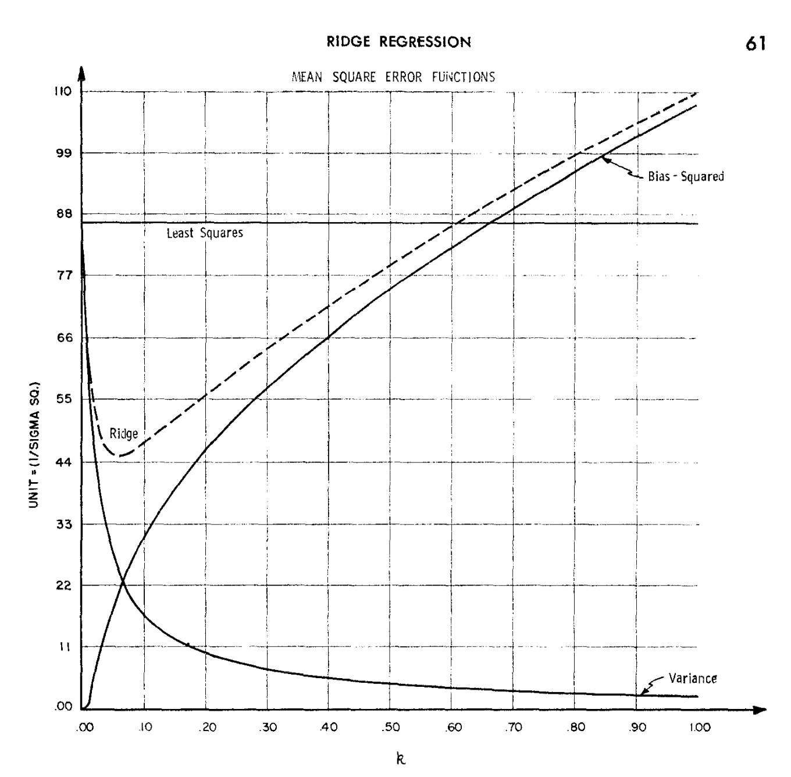
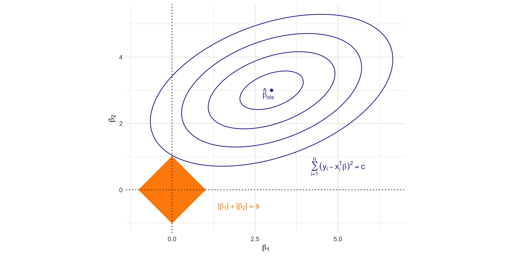

## [Homepage](../index.html)


::: columns
::: {.column width="30%"}

:::

::: {.column width="70%"}
-   In this unit we will cover the following [topics]{.orange}:

    -   Best subset regression
    -   Principal component regression
    -   Ridge regression
    -   Lasso, LARS, elastic-net

-   The common themes are called [variable selection]{.blue} and
    [shrinkage estimation]{.orange}.

-   The issue we face is the presence of a high number $p$ of covariates
    that are [potentially irrelevant]{.blue}.

-   This problem is quite challenging when the [ratio]{.blue} $p / n$ is
    [large]{.blue}.

-   In the [extreme case]{.orange} $p > n$, is there any hope to fit a
    meaningful model?
:::
:::

# A biostatistical motivation

## The `prostate` dataset

-   The `prostate` cancer data investigates the relationship between the
    prostate-specific [antigen]{.orange} and a number of clinical
    measures, in men about to receive a prostatectomy.

. . .

-   This
    [dataset](https://hastie.su.domains/ElemStatLearn/datasets/prostate.data)
    has been used in the [original paper]{.orange} by Tibshirani (1996)
    to present the lasso. A description is given in [Section
    3.2.1]{.blue} of HTF (2009).

. . .

-   We want to [predict]{.blue} the logarithm of a [prostate-specific
    antigen]{.orange} (`lpsa`) as a function of:

    -   logarithm of the cancer volume (`lcavol`);
    -   logarithm of the prostate weight (`lweight`);
    -   age each man (`age`);
    -   logarithm of the benign prostatic hyperplasia amount (`lbph`);
    -   seminal vesicle invasion (`svi`), a binary variable;
    -   logarithm of the capsular penetration (`lcp`);
    -   Gleason score (`gleason`), an ordered categorical variable;
    -   Percentage of Gleason scores $4$ and $5$ (`pgg45`).

## A `glimpse` of the `prostate` dataset

-   Summarizing, there are in total $8$ [variables]{.orange} that can be
    used to predict the antigen `lpsa`.

-   We [centered]{.orange} and [standardized]{.blue} all the covariates
    before the training/test split.

-   There are $n = 67$ observations in the [training]{.orange} set and
    $30$ in the [test]{.blue} set.

. . .

::: panel-tabset
## Original dataset


::: {.cell hash='un_C_cache/revealjs/unnamed-chunk-2_6b76e4f598c7ccfb3daa83aeae80fab5'}
::: {.cell-output .cell-output-stdout}
```
Rows: 97
Columns: 10
$ lcavol  <dbl> -0.5798185, -0.9942523, -0.5108256, -1.2039728, 0.7514161, -1.…
$ lweight <dbl> 2.769459, 3.319626, 2.691243, 3.282789, 3.432373, 3.228826, 3.…
$ age     <int> 50, 58, 74, 58, 62, 50, 64, 58, 47, 63, 65, 63, 63, 67, 57, 66…
$ lbph    <dbl> -1.3862944, -1.3862944, -1.3862944, -1.3862944, -1.3862944, -1…
$ svi     <int> 0, 0, 0, 0, 0, 0, 0, 0, 0, 0, 0, 0, 0, 0, 0, 0, 0, 0, 0, 0, 0,…
$ lcp     <dbl> -1.3862944, -1.3862944, -1.3862944, -1.3862944, -1.3862944, -1…
$ gleason <int> 6, 6, 7, 6, 6, 6, 6, 6, 6, 6, 6, 6, 7, 7, 7, 6, 7, 6, 6, 6, 6,…
$ pgg45   <int> 0, 0, 20, 0, 0, 0, 0, 0, 0, 0, 0, 0, 30, 5, 5, 0, 30, 0, 0, 0,…
$ lpsa    <dbl> -0.4307829, -0.1625189, -0.1625189, -0.1625189, 0.3715636, 0.7…
$ train   <lgl> TRUE, TRUE, TRUE, TRUE, TRUE, TRUE, FALSE, TRUE, FALSE, FALSE,…
```
:::
:::


## Standardized dataset


::: {.cell hash='un_C_cache/revealjs/unnamed-chunk-3_10a33a90e203e11f9be2fa7136dca1f8'}
::: {.cell-output .cell-output-stdout}
```
Rows: 97
Columns: 10
$ lcavol  <dbl> -1.63735563, -1.98898046, -1.57881888, -2.16691708, -0.5078744…
$ lweight <dbl> -2.00621178, -0.72200876, -2.18878403, -0.80799390, -0.4588340…
$ age     <dbl> -1.86242597, -0.78789619, 1.36116337, -0.78789619, -0.25063130…
$ lbph    <dbl> -1.0247058, -1.0247058, -1.0247058, -1.0247058, -1.0247058, -1…
$ svi     <dbl> -0.5229409, -0.5229409, -0.5229409, -0.5229409, -0.5229409, -0…
$ lcp     <dbl> -0.8631712, -0.8631712, -0.8631712, -0.8631712, -0.8631712, -0…
$ gleason <dbl> -1.0421573, -1.0421573, 0.3426271, -1.0421573, -1.0421573, -1.…
$ pgg45   <dbl> -0.8644665, -0.8644665, -0.1553481, -0.8644665, -0.8644665, -0…
$ lpsa    <dbl> -0.4307829, -0.1625189, -0.1625189, -0.1625189, 0.3715636, 0.7…
$ train   <lgl> TRUE, TRUE, TRUE, TRUE, TRUE, TRUE, FALSE, TRUE, FALSE, FALSE,…
```
:::
:::

:::

<!-- -   The variable `train` splits the data into a training and test set, -->

<!--     as in the textbook. -->

## Correlation matrix of `prostate`


::: {.cell layout-align="center" hash='un_C_cache/revealjs/unnamed-chunk-4_09ec98d6e2da92c16e94294c66ee91ea'}
::: {.cell-output-display}
{fig-align='center' width=3000}
:::
:::


## The regression framework

::: incremental
-   In this unit we will assume that the response variables $Y_i$
    (`lpsa`) are obtained as $$
    Y_i = f(\bm{x}_i) + \epsilon_i, \qquad
    $$ where $\epsilon_i$ are [iid]{.orange} random variables with
    $\mathbb{E}(\epsilon_i) = 0$ and
    $\text{var}(\epsilon_i) = \sigma^2$.

-   Unless specifically stated, we will [not]{.orange} assume the
    [Gaussianity]{.orange} of the errors $\epsilon_i$ nor make any
    specific assumption about $f(\bm{x})$, which could be
    [non-linear]{.blue}.

-   In practice, we [approximate]{.orange} the true $f(\bm{x})$ using a
    [linear model]{.blue}, e.g. by considering the following function$$
        f(\bm{x}_i; \beta_0, \beta) = \beta_0+ \beta_1 x_{i1} + \cdots + \beta_p x_{ip} =\beta_0 + \bm{x}_i^T\beta,
        $$ in which the regression coefficients must be estimated.

-   In this unit the [intercept]{.blue} $\beta_0$ will often play a
    special role, therefore we use a slightly different notation
    compared to [Unit A](unit_A.html).
:::

## The variable selection problem

-   Including a lot of covariates into the model is not necessarily a
    good thing!

. . .

-   Indeed, some variables are likely to be [irrelevant]{.blue}:

    -   they might be [correlated]{.orange} with other covariates and
        therefore [redundant]{.orange};
    -   they could be uncorrelated with the response `lpsa`.

. . .

-   If we use all the $p = 8$ available covariates, the estimated
    $f(\bm{x}; \hat{\beta_0}, \hat{\beta})$ might have a [high
    variance]{.orange}, without important gain in term of bias, i.e. a
    [large mean squared error]{.blue}.

-   We are looking for a [simpler model]{.orange} having, hopefully, a
    lower mean squared error.

. . .

-   These considerations are particularly relevant in cases in which
    $p > n$!

## A naïve approach: (ab)using p-values

::: {style="font-size: 75%;"}

::: {.cell hash='un_C_cache/revealjs/unnamed-chunk-5_912d5d2cc326cb68cf628428312b5ca0'}
::: {.cell-output-display}
|          | (Intercept)| lcavol| lweight|   age| lbph|  svi|   lcp| gleason| pgg45|
|:---------|-----------:|------:|-------:|-----:|----:|----:|-----:|-------:|-----:|
|estimate  |        2.46|   0.68|    0.26| -0.14| 0.21| 0.31| -0.29|   -0.02|  0.27|
|std.error |        0.09|   0.13|    0.10|  0.10| 0.10| 0.12|  0.15|    0.15|  0.15|
|statistic |       27.60|   5.37|    2.75| -1.40| 2.06| 2.47| -1.87|   -0.15|  1.74|
|p.value   |        0.00|   0.00|    0.01|  0.17| 0.04| 0.02|  0.07|    0.88|  0.09|
:::
:::

:::

. . .

-   It is common practice to use the [p-values]{.orange} to perform
    [model selection]{.blue} in a stepwise fashion.

-   However, what if the true $f(\bm{x})$ were not linear?

-   In many data mining problems, a [linear model]{.blue} is simply an
    approximation of the unknown $f(\bm{x})$ and hypothesis testing
    procedures are ill-posed.

. . .

-   Even if the true function were linear, using p-values would [not be
    a good idea]{.orange}, at least if done without appropriate
    [multiplicity corrections]{.blue}.

-   The above p-values are meant to be used in the context of a single
    hypothesis testing problem, [not]{.orange} to make [iterative
    choices]{.orange}.

## The predictive culture

::: columns
::: {.column width="25%"}
{fig-align="left"}
:::

::: {.column width="75%"}
-   "*All models are approximations. Essentially, all models are wrong,
    but some are useful*."

    [George E. P. Box]{.grey}

-   If the [focus]{.blue} is on [prediction]{.blue}, we do not
    necessarily care about selecting the "true" set of parameters.

-   In many data mining problems, the focus is on [minimizing]{.orange}
    the [prediction errors]{.orange}.

-   Hence, often times we may [accept some bias]{.blue} (i.e. we use a
    "wrong" but useful model), if this leads to a [reduction in
    variance]{.orange}.
:::
:::

## Overview of this unit

-   In this unit we will discuss two "discrete" methods:

    -   Best subset selection and its greedy approximations: forward /
        backward regression;
    -   Principal components regression (PCR).

-   Best subset selection perform [variable selection]{.orange}, whereas
    principal components regression [reduces the variance]{.orange} of
    the coefficients.

-   These "discrete" methods can be seen as the naïve counterpart of
    more advanced and [continuous]{.blue} ideas, that are presented in
    the second part of the Unit.

. . .

|                     | [Shrinkage]{.orange}           | [Variable selection]{.orange}   |
|------------------|-------------------------------|-----------------------|
| [Discrete]{.blue}   | Principal component regression | Best subset selection, stepwise |
| [Continuous]{.blue} | Ridge regression               | Relaxed Lasso                   |

. . .

-   Finally, the [lasso]{.blue} and the [elastic-net]{.orange} perform
    both shrinkage and variable selection.

## Overview of the final results

|               | Least squares | Best subset |    PCR |  Ridge | Lasso |
|:--------------|--------------:|------------:|-------:|-------:|------:|
| `(Intercept)` |         2.465 |       2.477 |  2.455 |  2.467 | 2.468 |
| `lcavol`      |         0.680 |       0.740 |  0.287 |  0.588 | 0.532 |
| `lweight`     |         0.263 |       0.316 |  0.339 |  0.258 | 0.169 |
| `age`         |        -0.141 |           . |  0.056 | -0.113 |     . |
| `lbph`        |         0.210 |           . |  0.102 |  0.201 |     . |
| `svi`         |         0.305 |           . |  0.261 |  0.283 | 0.092 |
| `lcp`         |        -0.288 |           . |  0.219 |  -0.172|     . |
| `gleason`     |        -0.021 |           . | -0.016 |  0.010 |     . |
| `pgg45`       |         0.267 |           . |  0.062 |  0.204 |     . |

# Best subset selection

## Best subset selection

-   Let us get back to our [variable selection problem]{.blue}.

-   In principle, we could perform an [exhaustive search]{.orange}
    considering all the $2^p$ possible models and then selecting the one
    having the best out-of-sample predictive performance.

. . .

::: callout-note
#### Best subset procedure

1.  Let $\mathcal{M}_0$ be the [null model]{.blue}, which contains no
    predictors, i.e. set $\hat{y}_i = \hat{\beta}_0 = \bar{y}$.

2.  For $k =1,\dots,p$, do:

    i.  Estimate [all]{.orange} the $\binom{p}{k}$ models that contain
        exactly $k$ covariates;

    ii. Identify the "best" model with $k$ covariates having the
        smallest $\text{MSE}_{k, \text{train}}$; call it
        $\mathcal{M}_k$.
:::

-   A model with more variables has lower [training]{.orange} error,
    namely
    $\text{MSE}_{k + 1, \text{train}} \le \text{MSE}_{k, \text{train}}$
    by construction. Hence, the optimal subset size $k$ must be chosen
    e.g. via [cross-validation]{.blue}.

## Step 1. and 2. of best subset selection


::: {.cell hash='un_C_cache/revealjs/unnamed-chunk-6_239b31c8c913b1d250219ead261483c8'}

:::

::: {.cell hash='un_C_cache/revealjs/unnamed-chunk-7_c522ede6390884717513174d42ff0c2b'}

:::

::: {.cell layout-align="center" hash='un_C_cache/revealjs/unnamed-chunk-8_a5fceb83f480e9b17f8e6e3ea10dbb28'}
::: {.cell-output-display}
{fig-align='center' width=2000}
:::
:::


## The "best" models $\mathcal{M}_1,\dots, \mathcal{M}_p$

-   The output of the [best subset selection]{.orange}, on the training
    set is:


::: {.cell hash='un_C_cache/revealjs/unnamed-chunk-9_c6d710f80ac5f62c2c94e295b87386a3'}
::: {.cell-output .cell-output-stdout}
```
         lcavol lweight age lbph svi lcp gleason pgg45
1  ( 1 ) "*"    " "     " " " "  " " " " " "     " "  
2  ( 1 ) "*"    "*"     " " " "  " " " " " "     " "  
3  ( 1 ) "*"    "*"     " " " "  "*" " " " "     " "  
4  ( 1 ) "*"    "*"     " " "*"  "*" " " " "     " "  
5  ( 1 ) "*"    "*"     " " "*"  "*" " " " "     "*"  
6  ( 1 ) "*"    "*"     " " "*"  "*" "*" " "     "*"  
7  ( 1 ) "*"    "*"     "*" "*"  "*" "*" " "     "*"  
8  ( 1 ) "*"    "*"     "*" "*"  "*" "*" "*"     "*"  
```
:::
:::


::: incremental
-   The above table means that the best model with $k = 1$ uses the
    variable `lcavol`, whereas when $k = 2$ the selected variables are
    `lcavol` and `lweight`, and so on and so forth.

-   Note that, in general, these models are [not]{.orange} necessarily
    [nested]{.orange}, i.e. a variable selected at step $k$ is not
    necessarily included at step $k +1$. Here they are, but it is a
    coincidence.
:::

. . .

-   What is the [optimal subset size]{.orange} $k$ in terms of
    out-of-sample mean squared error?

## The wrong way of doing cross-validation

::: incremental
-   Consider a regression problem with a [large number of
    predictors]{.orange} (relative to $n$) such as the `prostate`
    dataset.

-   A typical strategy for analysis might be as follows:

    1.  Screen the predictors: find a subset of "good" predictors that
        show fairly strong correlation with the response;

    2.  Using this subset of predictors (e.g. `lcavol`, `lweight` and
        `svi`), build a regression model;

    3.  Use cross-validation to estimate the prediction error of the
        model of the step 2.

-   Is this a correct application of cross-validation?

-   If your reaction was "[this is absolutely wrong!]{.orange}", it
    means you correctly understood the principles of cross-validation.

-   If you though this was an ok-ish idea, you may want to read [Section
    7.10.2]{.blue} of HTF (2009), called "the wrong way of doing
    cross-validation".
:::

## Step 3. of best subset selection via cross-validation


::: {.cell hash='un_C_cache/revealjs/unnamed-chunk-10_91b9b5cd687ad7cff8da9f1f096f1217'}

:::

::: {.cell layout-align="center" hash='un_C_cache/revealjs/unnamed-chunk-11_7560816b3f4fcea2fcab19246bf0df71'}
::: {.cell-output-display}
{fig-align='center' width=2000}
:::
:::


-   By applying the "1 standard error rule", we select $k = 2$, i.e.
    `lcavol` and `lweight`.

## Comments and computations

::: incremental
-   The correct way of doing cross-validation requires that the [best
    subset selection]{.blue} is performed on [every fold]{.orange},
    possibly obtaining different "best" models with the same size.

-   Best subset selection is conceptually appealing, but it has a [major
    limitation]{.orange}. There are $$
    \sum_{k=1}^p \binom{n}{k} = 2^p
    $$ models to consider, which is [computationally
    prohibitive]{.orange}!

-   There exists algorithms (i.e. [leaps and bounds]{.blue}) that makes
    this feasible for $p \approx 30$.

-   Recently, [Bertsimas et al.,
    2016](https://projecteuclid.org/journals/annals-of-statistics/volume-44/issue-2/Best-subset-selection-via-a-modern-optimization-lens/10.1214/15-AOS1388.full)
    proposed the usage of a mixed integer optimization formulation,
    allowing $p$ to be in the order of hundreds.

-   Despite these advances, this problem remains [computationally very
    expensive]{.orange}. See also the recent paper [Hastie et al.
    (2020)](https://projecteuclid.org/journals/statistical-science/volume-35/issue-4/Best-Subset-Forward-Stepwise-or-Lasso-Analysis-and-Recommendations-Based/10.1214/19-STS733.full)
    for additional considerations and comparisons.
:::

## Forward regression

-   Forward regression is [greedy approximation]{.orange} of best subset
    selection, that produces a sequence of [nested]{.blue} models. It is
    computationally feasible and can be applied when $p > n$.

. . .

::: callout-note
#### Forward regression

1.  Let $\mathcal{M}_0$ be the [null model]{.blue}, which contains no
    predictors, i.e. set $\hat{y}_i = \hat{\beta}_0 = \bar{y}$.

2.  For $k = 0,\dots, \min(n - 1, p - 1)$, do:

    i.  Consider the $p − k$ models that augment the predictors in
        $\mathcal{M}_k$ with [one additional covariate]{.orange}.

    ii. Identify the "best" model among the above $p - k$ competitors
        having the smallest $\text{MSE}_{k, \text{train}}$ and call it
        $\mathcal{M}_k$.
:::

. . .

-   It can be shown that the identification of the [optimal new
    predictor]{.blue} can be efficiently computed using the [QR
    decomposition]{.orange} (see Exercises).

## Backward regression

-   When $p < n$, an alternative greedy approach is [backward
    regression]{.orange}, which also produces a sequence of
    [nested]{.blue} models.

. . .

::: callout-note
#### Backward regression

1.  Let $\mathcal{M}_p$ be the [full model]{.blue}, which contains all
    the predictors.

2.  For $k = p, p - 1,\dots, 1$, do:

    i.  Consider the $k$ models that contain [all but one]{.orange} of
        the predictors in $\mathcal{M}_k$, for a total of $k − 1$
        predictors.

    ii. Identify the "best" model $\mathcal{M}_k$ among these $k$ models
        having the smallest $\text{MSE}_{k, \text{train}}$.
:::

. . .

-   It can be shown that the [dropped predictor]{.blue} is the one with
    the lowest absolute $Z$-score or, equivalently, the [highest
    p-value]{.orange} (see Exercises).

## Forward, backward and best subset


::: {.cell hash='un_C_cache/revealjs/unnamed-chunk-12_610837eb054e0d752ad55cb96e0a38db'}

:::

::: {.cell layout-align="center" hash='un_C_cache/revealjs/unnamed-chunk-13_5ccdbba968fb621b11820d126ed43ecd'}
::: {.cell-output-display}
{fig-align='center' width=2000}
:::
:::


-   In the `prostate` dataset, forward, backward and best subset
    selection all gave exactly the [same path of solutions]{.orange} on
    the full training set.

## Pros and cons of subset selection strategies

::: callout-tip
#### Pros

-   Best subset selection is appealing because of its [conceptual
    simplicity]{.blue}.

-   Best subset and forward regression can be used, when computations are not problematic, even when $p > n$.
:::

. . .

::: callout-warning
#### Cons

-   Subset strategies tend to select models that are "[too
    simple]{.orange}", especially in presence of correlated variables.

-   Despite the recent advances, when $p$ is large best subset selection
    is [computationally unfeasible]{.orange}.

-   Leaps and bounds computational strategies can not be easily
    generalized to GLMs.
:::

# Principal components regression

## Data compression

::: columns
::: {.column width="30%"}

:::

::: {.column width="70%"}
-   At this point we established that [many covariates = many
    problems]{.orange}.

-   Instead of selecting the "best" variables, let us consider a
    different perspective.

-   We consider a [compressed]{.blue} version of the covariates that has
    smaller dimension $k$ but retains most information.

-   Intuitively, we want to [reduce the variance]{.orange} by finding a
    good compression, without sacrificing too much bias.

-   The main statistical tool, unsurprisingly, will be the celebrated
    [principal components analysis]{.blue} (PCA).

-   We will compress the covariate information $\bm{X}$ using a smaller
    set of variables $\bm{Z}$, i.e. the principal components.
:::
:::

## The intercept term

::: incremental
-   In principal component regression and in other related methods
    (ridge, lasso and elastic-net), we do [not]{.orange} wish to
    [compress]{.orange} the [intercept]{.orange} term $\beta_0$. We would like to "remove it".

-   Let us consider a [reparametrization]{.blue} of the linear model, in
    which $\alpha = \beta_0 + \bar{\bm{x}}^T\beta$. This is equivalent
    to a linear model with [centered predictors]{.orange}: $$
    \begin{aligned}
    f(\bm{x}_i; \alpha, \beta) & = \beta_0 + \bm{x}_i^T\beta = \alpha - \bar{\bm{x}}^T\beta + \bm{x}_i^T\beta  = \alpha + (\bm{x}_i -\bar{\bm{x}})^T\beta. \\
    \end{aligned}
    $$

-   The estimates for $(\alpha, \beta)$ can be now computed separately
    and [in two steps]{.orange}.

-   The [estimate]{.orange} of the [intercept]{.orange} with centered
    predictors is $\hat{\alpha} = \bar{y}$. In fact: $$
    \hat{\alpha} = \arg\min_{\alpha \in \mathbb{R}}\sum_{i=1}^n\{y_i - \alpha - (\bm{x}_i -\bar{\bm{x}})^T\beta\}^2 = \frac{1}{n}\sum_{i=1}^n\{y_i - (\bm{x}_i -\bar{\bm{x}})^T\beta\} = \frac{1}{n}\sum_{i=1}^ny_i.
    $$

-   Then, the [estimate of $\beta$]{.blue} can be obtained considering a
    linear model [without intercept]{.orange}: $$
        f(\bm{x}_i; \beta) = (\bm{x}_i -\bar{\bm{x}})^T\beta,
    $$ employed to predict the [centered responses]{.blue}
    $y_i - \bar{y}$.
:::

## Centering the predictors

-   In principal components regression, we replace [original
    data]{.orange} $Y_i = f(\bm{x}_i) + \epsilon_i$ with their
    [centered]{.blue} version: $$
    x_{ij} - \bar{x}_j, \qquad y_i - \bar{y}, \qquad i=1,\dots,n; \ \ j=1,\dots,p.
    $$

. . .

-   In the end, we will make predictions in the [original scale]{.blue},
    which requires a simple [final adjustment]{.orange}. One simply need
    to compute the intercept term $$
    \hat{\beta}_0 = \bar{y} - \bar{\bm{x}}\hat{\beta},
    $$ and then compute the predictions via the formula
    $\hat{\beta}_0 + \bm{x}_i^T\hat{\beta} = \hat{\alpha} + \bm{x}_{i}^T\hat{\beta}$.

. . .

-   [Remark]{.orange}. The centering operation is a mathematical trick
    that facilitate the exposition, but is unconsequential from an
    estimation point of view.

## Centering the predictors II

::: callout-note
#### Centering assumption

In principal components regression, we assume the data have been
previously [centered]{.orange}: $$
    \frac{1}{n}\sum_{i=1}^n y_{i} = 0, \qquad \frac{1}{n}\sum_{i=1}^nx_{ij} = 0, \qquad j=1,\dots,p.
    $$
:::

. . .

-   Using centered predictor means that we can focus on linear models
    [without intercept]{.blue}: $$
    f(\bm{x}_{i}; \beta) = x_{i1}\beta_1 + \cdots + x_{ip}\beta_p = \bm{x}_{i}^T\beta.
    $$

. . .

-   Under the centering assumption the [covariance matrix]{.orange} of
    the data is simply $$
    S = \frac{1}{n} \bm{X}^T\bm{X}.
    $$

<!-- -   If in addition each variable has been [scaled]{.blue} by their -->

<!--     standard deviations, then $n^{-1} \bm{X}^T\bm{X}$ corresponds to the -->

<!--     [correlation]{.blue} matrix. -->

## Singular value decomposition (SVD)

-   Let $\bm{X}$ be a $n \times p$ matrix. Then, its full form [singular
    value decomposition]{.orange} is: $$
    \bm{X} = \bm{U} \bm{D} \bm{V}^T = \sum_{j=1}^m d_j \tilde{\bm{u}}_j \tilde{\bm{v}}_j^T,
    $$ with $m =\min\{n, p\}$ and where:

    -   the $n \times n$ matrix
        $\bm{U} = (\tilde{\bm{u}}_1, \dots, \tilde{\bm{u}}_n)$ is
        [orthogonal]{.orange}, namely:
        $\bm{U}^T \bm{U} = \bm{U}\bm{U}^T= I_n$;
    -   the $p \times p$ matrix
        $\bm{V} = (\tilde{\bm{v}}_1,\dots,\tilde{\bm{v}}_p)$ is
        [orthogonal]{.orange}, namely:
        $\bm{V}^T \bm{V} = \bm{V}\bm{V}^T= I_p$;
    -   the $n \times p$ matrix $\bm{D}$ has [diagonal]{.blue} entries
        $[\bm{D}]_{jj} = d_j$, for $j=1,\dots,m$, and zero entries
        elsewhere;

-   The real numbers $d_1 \ge d_2 \ge \cdots \ge d_m \ge 0$ are called
    [singular values]{.blue}.

-   If one or more $d_j = 0$, then the matrix $\bm{X}$ is singular.

## Principal component analysis I

::: incremental
-   Le us assume that $p < n$ and that $\text{rk}(\bm{X}) = p$,
    recalling that $\bm{X}$ is a [centered]{.orange} matrix.

-   Using SVD, the matrix $\bm{X}^T\bm{X}$ can be expressed as $$
    \bm{X}^T\bm{X} = (\bm{U} \bm{D} \bm{V}^T)^T \bm{U} \bm{D} \bm{V}^T = \bm{V} \bm{D}^T \textcolor{red}{\bm{U}^T \bm{U}} \bm{D} \bm{V}^T = \bm{V} \bm{\Delta}^2 \bm{V}^T,
    $$ where $\bm{\Delta}^2 = \bm{D}^T\bm{D}$ is a $p \times p$
    [diagonal]{.blue} matrix with entries $d_1^2,\dots,d_p^2$.

-   This equation is at the heart of [principal component
    analysis]{.blue} (PCA). Define the matrix $$
    \bm{Z} = \bm{X}\bm{V} = \bm{U}\bm{D},
    $$ whose columns $\tilde{\bm{z}}_1,\dots,\tilde{\bm{z}}_p$ are
    called [principal components]{.orange}.

-   The matrix $\bm{Z}$ is orthogonal, because
    $\bm{Z}^T\bm{Z} = \bm{D}^T\textcolor{red}{\bm{U}^T \bm{U}} \bm{D} = \bm{\Delta}^2$,
    which is diagonal.

-   Moreover, by definition the entries of $\bm{Z}$ are linear
    combination of the original variables: $$
    z_{ij} = x_{i1}v_{i1} + \cdots + x_{ip} v_{ip} = \bm{x}_{i}^T\tilde{\bm{v}}_j.
    $$ The columns $\tilde{\bm{v}}_1,\dots,\tilde{\bm{v}}_p$ of $\bm{V}$
    are sometimes called [loadings]{.blue}.
:::

## Principal component analysis II

::: incremental
-   Principal components form an orthogonal basis of $\bm{X}$, but they
    are not a "random" choice and they do [not]{.orange} coincide with
    them [Gram-Schmidt]{.orange} basis of [Unit
    A](un_A.html#the-qr-decomposition-i).

-   Indeed, the [first principal component]{.blue} is the linear
    combination having [maximal variance]{.orange}: $$
    \tilde{\bm{v}}_1 = \arg\max_{\bm{v} \in \mathbb{R}^p} \text{var}(\bm{X}\bm{v})= \arg\max_{\bm{v} \in \mathbb{R}^p} \frac{1}{n} \bm{v}^T\bm{X}^T\bm{X} \bm{v}, \quad \text{ subject to } \quad \bm{v}^T \bm{v} = 1.
    $$

-   The [second principal component]{.blue} maximizes the variance under
    the additional constraint of being [orthogonal]{.orange} to the
    former. And so on and so forth.

-   The values $d_1^2 \ge d_2^2 \ge \dots \ge d_p^2 > 0$ are the
    [eigenvalues]{.orange} of $\bm{X}^T\bm{X}$ and correspond to the
    rescaled [variances]{.blue} of each principal component, that is
    $\text{var}(\tilde{\bm{z}}_j) = \tilde{\bm{z}}_j^T \tilde{\bm{z}}_j/n = d^2_j / n$.

-   Hence, the quantity $d_j^2 / \sum_{j'=1}^p d_{j'}^2$ measures the
    amount of total variance captured by principal components.
:::

## Principal component analysis: `prostate` data


::: {.cell layout-align="center" hash='un_C_cache/revealjs/unnamed-chunk-14_fda9aaf7c93e5f4a5cf4bc2b9396ecfa'}
::: {.cell-output-display}
{fig-align='center' width=2000}
:::
:::


## Principal components regression (PCR)

::: incremental
-   We use the first $k \le p$ [principal components]{.blue} to predict
    the responses $y_{i}$ via $$
    f(\bm{z}_i; \gamma) = \gamma_1 z_{i1} + \cdots + \gamma_kz_{ik}, \qquad i=1,\dots,n,
    $$

-   Because of orthogonality, the least squares solution is
    straightforward to compute: $$
    \hat{\gamma}_j = \frac{\tilde{\bm{z}}_j^T\bm{y}}{\tilde{\bm{z}}_j^T\tilde{\bm{z}}_j} = \frac{1}{d_j^2}\tilde{\bm{z}}_j^T\bm{y}, \qquad j=1,\dots,k.
    $$

-   The principal components are in [order of importance]{.orange} and
    effectively [compressing the information]{.blue} contained in
    $\bm{X}$ using only $k \le p$ variables.

-   When $k = p$ we are simply rotating the original matrix
    $\bm{X} = \bm{Z}\bm{V}$, i.e. performing [no compression]{.orange}.
    The predicted values coincide with OLS.

-   The number $k$ is a [complexity parameter]{.blue} which should be
    chosen via information criteria or cross-validation.
:::

## Selection of $k$: cross-validation


::: {.cell hash='un_C_cache/revealjs/unnamed-chunk-15_bcb33e090d9f9a81aa075c9ece6a66cd'}

:::

::: {.cell layout-align="center" hash='un_C_cache/revealjs/unnamed-chunk-16_82b11a339292aa623e91972ae45c08cb'}
::: {.cell-output-display}
{fig-align='center' width=2000}
:::
:::


## Shrinkage effect of principal components I

::: incremental
-   A closer look to the PCR solution reveals some interesting aspects.
    Recall that: $$
    \tilde{\bm{z}}_j = \bm{X}\tilde{\bm{v}}_j = d_j \tilde{\bm{u}}_j,  \qquad j=1,\dots,p.
    $$

-   The [predicted values]{.orange} for the [centered responses]{.blue}
    $\bm{y}$ of the PCR with $k$ components are: $$
    \bm{X}\hat{\beta}_\text{pcr} = \sum_{j=1}^k \tilde{\bm{z}}_j \hat{\gamma}_j = \bm{X} \sum_{j=1}^k \tilde{\bm{v}}_j \hat{\gamma}_j, \qquad \text{ where } \qquad \hat{\beta}_\text{pcr} = \sum_{j=1}^k \tilde{\bm{v}}_j \hat{\gamma}_j.
    $$

-   This representation highlights two important aspects:

    -   It is possible to express the PCR solution in the original
        scale, for better [interpretability]{.orange};
    -   The vector $\hat{\beta}_\text{pcr}$ is a [constrained
        solution]{.blue}, being a combination of $k \le p$ coefficients,
        therefore [reducing]{.orange} the [complexity]{.orange} of the
        model and [shrinking]{.blue} the coefficients.

-   When $k = 1$, then the $\hat{\beta}_\text{pcr}$ estimate coincide
    with the scaled loading vector
    $\hat{\beta}_\text{pcr} = \hat{\gamma}_1 \tilde{\bm{v}}_1$;

-   When $k = p$ then the $\hat{\beta}_\text{pcr}$ coincides with
    [ordinary least squares]{.blue} (see Exercises).
:::

## Shrinkage effect of principal components II {#shrinkage-effect-of-principal-components-ii}

::: incremental
-   The [variance]{.orange} of $\hat{\beta}_\text{pcr}$, assuming iid
    errors $\epsilon_i$ in the [original data]{.blue}, is: $$
    \text{var}(\hat{\beta}_\text{pcr}) = \sigma^2\sum_{j=1}^k \frac{1}{d_j^2} \tilde{\bm{v}}_j\tilde{\bm{v}}_j^T.
    $$

-   Thus, if a [multicollinearity]{.blue} exists, then it appears as a
    principal component with very small variance, i.e. a small $d_j^2$.
    Its removal therefore drastically [reduces]{.orange} the
    [variance]{.orange} of $\hat{\beta}_\text{pcr}$.

-   Furthermore, the predicted values for the [centered data]{.orange}
    can be expressed as $$
    \bm{X}\hat{\beta}_\text{pcr} = \sum_{j=1}^k \tilde{\bm{z}}_j \hat{\gamma}_j = \sum_{j=1}^k \tilde{\bm{z}}_j  \frac{\tilde{\bm{z}}_j^T\bm{y}}{\tilde{\bm{z}}_j^T\tilde{\bm{z}}_j} = \sum_{j=1}^k \textcolor{darkblue}{d_j} \tilde{\bm{u}}_j  \frac{\textcolor{darkblue}{d_j}}{\textcolor{darkblue}{d_j^2}} \frac{\tilde{\bm{u}}_j^T\bm{y}}{\textcolor{red}{\tilde{\bm{u}}_j^T\tilde{\bm{u}}_j}} = \sum_{j=1}^k \tilde{\bm{u}}_j \tilde{\bm{u}}_j^T \bm{y}.
    $$

-   The columns of $\bm{U}$, namely the vectors $\tilde{\bm{u}}_j$ are
    the [normalized principal components]{.blue}.

-   Hence, we are shrinking the predictions towards the main [principal
    directions]{.orange}.
:::

## Shrinkage effect of principal components III


::: {.cell layout-align="center" hash='un_C_cache/revealjs/unnamed-chunk-17_75ea8c31c0a5864be1440e6467045323'}
::: {.cell-output-display}
{fig-align='center' width=1800}
:::
:::


## Pros and cons of PCR

::: callout-tip
#### Pros

- Principal components are a natural tool to [reduce the complexity]{.blue} of the data, especially in presence of [highly correlated]{.orange} variables.

- If you transform back the coefficients, there is a [clean
    interpretation]{.blue} of the impact of the covariates on the
    response.

-   Principal components might be interesting in their own right, as
    they describe the [dependence structure]{.blue} among covariates.
:::

. . .

::: callout-warning
#### Cons

-   [All the variables]{.orange} are used for predictions, which could
    be computationally demanding.

-   The shrinkage effect on the regression coefficients is somewhat
    indirect and not smooth.

-   Principal component regression can not be applied when $p > n$.
:::

# Ridge regression

## Shrinkage methods

::: columns
::: {.column width="30%"}
{fig-align="left"}
:::

::: {.column width="70%"}


- Shrinkage methods are popular tools for handling the issue of multiple variables.

- Shrinkage [regularizes]{.blue} the estimates, [constraining]{.blue} the [size]{.blue} of the regression coefficients.

- This lead to [biased estimator]{.orange} with, hopefully, lower variance.

- As a byproduct, the induced regularization procedure enables estimation even when $p > n$.

- The first method that has been proposed is called [ridge regression]{.orange}. The lasso and the elastic-net are other examples. 

:::
:::


## The ridge regularization method

-   The ridge estimator is the most common [shrinkage method]{.blue} and
    is the [minimizer]{.orange} of $$
    \sum_{i=1}^n(y_i - \beta_0 -  \bm{x}_i^T\beta)^2 \qquad \text{subject to} \qquad \sum_{j=1}^p \beta_j^2 \le s.
    $$

. . .

-   When the [complexity parameter]{.blue} $s$ is small, the
    coefficients are explicitly [shrinked]{.orange}, i.e. biased,
    [towards zero]{.orange}.

-   On the other hand, if $s$ is large enough, then the ridge estimator
    coincides with ordinary least squares.

. . .

-   In ridge regression, the [variability]{.orange} of the estimator is
    explicitly [bounded]{.orange}, although this comes with some
    [bias]{.blue}. The parameter $s$ controls the bias-variance
    trade-off.

. . .

-   The intercept term $\beta_0$ is [not penalized]{.orange}, because
    there are no strong reasons to believe that the mean of $y_i$ equals
    zero. However, as before, we would like to "remove the intercept".

## Centering and scaling the predictors I

-   The ridge solutions are [not equivariant]{.orange} under [scalings
    of the input]{.orange}, so one normally [standardizes]{.blue} the
    input to have unit variance, if they are not in the same scale.

. . .

-   Moreover, as for PCR, we can estimate the intercept using a
    [two-step procedure]{.orange}:
    -   The reparametrization $\alpha = \beta_0 + \bar{\bm{x}}^T\beta$
        is equivalent to centering the predictors;
    -   The estimate for the centered intercept is
        $\hat{\alpha} = \bar{y}$;
    -   The ridge estimate can be obtained considering a model without
        intercept, using centered responses and predictors.

. . .

-   Hence, in ridge regression we replace [original data]{.orange}
    $Y_i = f(\bm{x}_i) + \epsilon_i$ with their [standardized]{.blue}
    version: $$ 
    \frac{x_{ij} - \bar{x}_j}{s_j}, \qquad y_i - \bar{y}, \qquad i=1,\dots,n; \ \ j=1,\dots,p.
    $$ where $s_j^2 = n^{-1}\sum_{i=1}^n (x_{ij} - \bar{x}_j)^2$ is the
    [sample variance]{.blue}.

## Centering and scaling the predictors II

-   It is easy to show (see Exercises) that the [coefficients]{.orange}
    expressed in the [original scale]{.blue} are $$
    \hat{\beta}_0 = \bar{y} - \bar{\bm{x}}\hat{\beta}_\text{ridge}, \qquad \hat{\beta}_\text{scaled-ridge} = \text{diag}(1 / s_1,\dots, 1/s_p) \hat{\beta}_\text{ridge}.
    $$ Thus, the [predictions]{.orange} on the [original scale]{.blue}
    are
    $\hat{\beta}_0 + \bm{x}_i^T\hat{\beta}_\text{scaled-ridge} = \bar{y} + \bm{x}_{i}^T\hat{\beta}_\text{ridge}$.

. . .

::: callout-note
For ridge problems we will assume the data have been previously
[standardized]{.orange}, namely $$
    \frac{1}{n}\sum_{i=1}^ny_{i} = 0, \qquad \frac{1}{n}\sum_{i=1}^nx_{ij} = 0, \qquad \frac{1}{n}\sum_{i=1}^n x_{i}^2 = 1\qquad j=1,\dots,p.
    $$
:::

. . .

-   We will say that the [ridge estimator]{.blue}
    $\hat{\beta}_\text{ridge}$ is the [minimizer]{.orange} of following
    system $$
    \sum_{i=1}^n(y_i - \bm{x}_{i}^T\beta)^2 \qquad \text{subject to} \qquad \sum_{j=1}^p \beta_j^2 \le s.
    $$

## Lagrange multipliers and ridge solution

-   The ridge regression problem can be [equivalently
    expressed]{.orange} in its [Lagrangian
    form](https://en.wikipedia.org/wiki/Karush–Kuhn–Tucker_conditions),
    which greatly facilitates computations. The ridge estimator
    $\hat{\beta}_\text{ridge}$ is the [minimizer]{.orange} of $$
    \sum_{i=1}^n(y_{i} - \bm{x}_{i}^T\beta)^2 + \lambda \sum_{j=1}^p\beta_j^2 = \underbrace{||\bm{y} - \bm{X}\beta||^2}_{\text{least squares}} + \underbrace{\lambda ||\beta||^2}_{\text{\textcolor{red}{ridge penalty}}},
    $$ where $\lambda > 0$ is a [complexity parameter]{.blue}
    controlling the [penalty]{.orange}. It holds that
    $s = ||\hat{\beta}_\text{ridge} ||^2$.

. . .

-   When $\lambda = 0$ then
    $\hat{\beta}_\text{ridge} = \hat{\beta}_\text{ols}$ whereas when
    $\lambda \rightarrow \infty$ we get $\hat{\beta}_\text{ridge} = 0$.

. . .

::: callout-note
#### Ridge regression estimator

For any $n\times p$ design matrix $\bm{X}$, not necessarily of
full-rank, the ridge estimator is $$
\hat{\beta}_\text{ridge} = (\bm{X}^T\bm{X} + \lambda I_p)^{-1}\bm{X}^T\bm{y}.
$$ Such an estimator [always exists]{.blue} and is [unique]{.orange}
(even when $p > n$).
:::

<!-- ## Mathematical details -->

<!-- ::: incremental -->

<!-- - The matrix $\bm{X}^T\bm{X} + \lambda I_p$ is [invertible]{.blue} for any $\lambda > 0$.  -->

<!-- - For any $\lambda >0$, the ridge solution is always at the [boundary]{.orange}, that is, is never an interior point. Indeed, if $\bm{X}$ is full rank, it can be shown that -->

<!-- $$ -->

<!-- ||\hat{\beta}_\text{ridge}||^2 \le ||\hat{\beta}||^2. -->

<!-- $$ -->

<!-- - The size of the spherical ridge parameter constraint [shrinks monotonously]{.orange} as $\lambda$ increases: -->

<!-- $$ -->

<!-- \frac{\partial}{\partial \lambda} ||\hat{\beta}_\text{ridge}||^2 < 0, -->

<!-- $$ -->

<!-- ::: -->

## The geometry of the ridge solution


::: {.cell hash='un_C_cache/revealjs/unnamed-chunk-18_658884ce7464d582b3b1bf107018debe'}
::: {.cell-output-display}
{width=2000}
:::
:::


## The ridge path


::: {.cell hash='un_C_cache/revealjs/unnamed-chunk-19_d9a88e6fecf8e91680fd5b54b482f543'}

:::

::: {.cell hash='un_C_cache/revealjs/unnamed-chunk-20_13bea3910529a133964dc481c5e9a569'}

:::

::: {.cell layout-align="center" hash='un_C_cache/revealjs/unnamed-chunk-21_3ab7809f6ca0e1ef477f6f484d70d225'}
::: {.cell-output-display}
{fig-align='center' width=1800}
:::
:::


## Comments on the ridge path

-   The values of $\lambda$ are in somewhat [arbitrary scale]{.orange}.
    The ridge penalty has a concrete effect starting from
    $\lambda / n > 0.1$ or so.

-   The variable `lcavol` is arguably the most important, followed by
    `lweight` and `svi`, being the one that receive less shrinkage
    compared to the others.

. . .

-   The coefficient of `age`, `gleason` and `lcp`, is negative at the
    beginning and then become positive for large values of $\lambda$.

-   This indicate that their negative value in $\hat{\beta}_\text{ols}$
    was probably a consequence of their [correlation]{.orange} with
    other variables.

. . .

-   There is an interesting similarity between this plot and the one of
    principal component regression... is it a coincidence?

## Shrinkage effect of ridge regression I

-   Considering, once again, the [singular value
    decomposition]{.orange}, we get: $$\begin{aligned}
    \bm{X}\hat{\beta}_\text{ridge} &= \bm{X}(\bm{X}^T\bm{X} + \lambda I_p)^{-1}\bm{X}^T\bm{y} \\
    & = \bm{U}\bm{D} \bm{V}^T[\bm{V}(\bm{D}^T\bm{D} + \lambda I_p)\bm{V}^T]^{-1}(\bm{U}\bm{D}\bm{V})^T\bm{y}  \\
    & = \bm{U}\bm{D} \textcolor{red}{\bm{V}^T\bm{V}}(\bm{D}^T\bm{D} + \lambda I_p)^{-1} \textcolor{red}{\bm{V}^T \bm{V}} \bm{D}^T \bm{U} ^T\bm{y} \\
    & = \bm{U}\bm{D}(\bm{D}^T\bm{D} + \lambda I_p)^{-1}\bm{D}^T\bm{U}^T\bm{y} \\
    & = \bm{H}_\text{ridge}\bm{y} = \sum_{j=1}^p \tilde{\bm{u}}_j \frac{d_j^2}{d_j^2 + \lambda}\tilde{\bm{u}}_j^T \bm{y},
    \end{aligned}
    $$ where
    $\bm{H}_\text{ridge} = \bm{X}(\bm{X}^T\bm{X} + \lambda I_p)^{-1}\bm{X}^T$
    is the so-called [hat matrix]{.blue} of ridge regression.

. . .

-   This means that ridge regression [shrinks]{.blue} the [principal
    directions]{.blue} by an amount that depends on the
    [eigenvalues]{.orange} $d_j^2$.

-   In other words, it [smoothly reduces]{.orange} the impact of the
    [redundant]{.orange} information.

## Shrinkage effect of ridge regression II

-   A sharp [connection]{.blue} with [principal components
    regression]{.blue} is therefore revealed.

-   Compare the previous formula for $\bm{X}\hat{\beta}_\text{ridge}$
    with [the one we previously
    obtained](#shrinkage-effect-of-principal-components-ii) for
    $\bm{X}\hat{\beta}_\text{pcr}$.

. . .

-   More explicitly, for [ridge regression]{.orange} we will have that
    $$
    \hat{\beta}_\text{ridge} = \bm{V}\text{diag}\left(\frac{d_1}{d_1^2 + \lambda}, \dots, \frac{d_p}{d_p^2 + \lambda}\right)\bm{U}^T\bm{y}.
    $$ whereas for [principal components regression]{.blue} with $k$
    components we get $$
    \hat{\beta}_\text{pcr} = \bm{V}\text{diag}\left(\frac{1}{d_1}, \dots, \frac{1}{d_k}, 0, \dots, 0\right)\bm{U}^T\bm{y}.
    $$

. . .

-   Both operate on the singular values, but where principal component
    regression [thresholds]{.blue} the singular values, [ridge
    regression]{.orange} shrinks them.

## Bias-variance trade-off

-   The ridge regression [add some bias]{.orange} to the estimates, but
    it [reduces]{.blue} their [variance]{.blue}.

. . .

-   The [variance]{.orange} of $\hat{\beta}_\text{ridge}$, assuming iid
    errors $\epsilon_i$ in the [original scale]{.blue} with variance
    $\sigma^2$, results: $$
    \text{var}(\hat{\beta}_\text{ridge}) = \sigma^2\sum_{j=1}^p \frac{d_j^2}{(d_j^2 + \lambda)^2} \tilde{\bm{v}}_j\tilde{\bm{v}}_j^T,
    $$ whose diagonal elements are always smaller than those of
    $\text{var}(\hat{\beta}_\text{ols})$.

. . .

-   The above formula highlights that ridge will be very
    [effective]{.blue} in presence highly [correlated variables]{.blue},
    as they will be "shrunk" away by the penalty.

-   What typically happens is that such a reduction in variance
    [compensate]{.orange} the increase in bias, especially when $p$ is
    large relative to $n$.

## ☠️ - A historical perspective I

::: incremental
-   The ridge regression estimator was originally proposed by Hoerl and
    Kennard (1970) with a quite different motivation in mind.

-   In linear models, the estimate of $\beta$ is obtained by solving the
    [normal equations]{.blue} $$
    (\bm{X}^T\bm{X})\beta = \bm{X}^T\bm{y},
    $$ which could be [ill-conditioned]{.orange}.

-   In other words, the [condition number]{.blue} $$
    \kappa(\bm{X}^T\bm{X}) = \frac{d_1^2}{d_p^2},
    $$ might be very large, leading to [numerical
    inaccuracies]{.orange}, since the matrix $\bm{X}^T\bm{X}$ is
    [numerically singular]{.blue} and therefore not invertible in
    practice.
:::

## ☠️ - A historical perspective II

::: incremental
-   Ridge provides a [remedy]{.blue} for [ill-conditioning]{.orange}, by
    adding a "ridge" to the diagonal of $\bm{X}^T\bm{X}$, obtaining the
    modified normal equations $$
    (\bm{X}^T\bm{X} + \lambda I_p)\beta = \bm{X}^T\bm{y}.
    $$

-   The [condition number]{.orange} of the modified
    $(\bm{X}^T\bm{X} + \lambda I_p)$ matrix becomes $$
    \kappa(\bm{X}^T\bm{X} + \lambda I_p) = \frac{\lambda + d_1^2}{\lambda + d_p^2}.
    $$

-   Notice that even if $d_p = 0$, i.e. the matrix $\bm{X}$ is
    [singular]{.blue}, then condition number will be finite as long as
    $\lambda > 0$.

-   This technique is known as [Tikhonov regularization]{.orange}, after
    the Russian mathematician Andrey Tikhonov.
:::

## ☠️ - A historical perspective III

{fig-align="center" width="40%"}

-   Figure 1 of the [original paper]{.orange} by Hoerl and Kennard
    (1970), displaying the bias-variance [trade-off]{.blue}.

## On the choice of $\lambda$

-   The [penalty parameter]{.orange} $\lambda$ determines the amount of
    bias and variance of $\hat{\beta}_\text{ridge}$ and therefore it
    must be carefully [estimated]{.blue}.

. . .

-   [Minimizing]{.blue} the loss
    $||\bm{y} - \bm{X}\hat{\beta}_\text{ridge}||^2$ over $\lambda$ is a
    [bad idea]{.orange}, because it would always lead to $\lambda = 0$,
    corresponding to
    $\hat{\beta}_\text{ridge} = \hat{\beta}_\text{ols}$.

-   Indeed, $\lambda$ is a [complexity]{.blue} parameter and, like the
    number of covariates, should be selected using [information
    criteria]{.orange} or training/test and [cross-validation]{.orange}.

. . .

-   Suppose we wish to use an [information criteria]{.blue} such as the
    AIC or BIC, of the form $$
      \text{IC}(p) = -2 \ell(\hat{\beta}_\text{ridge}) + \text{penalty}(\text{``degrees of freedom"}).
      $$ We need a careful definition of [degrees of freedom]{.blue}
    that is appropriate in this context.

-   The current definition of degrees of freedom, i.e. the number of
    [non-zero coefficients]{.orange}, is [not appropriate]{.orange} for
    ridge regression, because it would be equal to $p$ for any value of
    $\lambda$.

## Effective degrees of freedom I

-   Let us recall that the original data are
    $Y_i = f(\bm{x}_i) + \epsilon_i$ and that the [optimism]{.orange}
    for a generic estimator $\hat{f}(\bm{x})$ is defined as the
    following average of covariances $$
    \text{Opt} = \frac{2}{n}\sum_{i=1}^n\text{cov}(Y_i, \hat{f}(\bm{x}_i)),
    $$ which is equal to $\text{Opt}_\text{ols} = (2\sigma^2p)/ n$ in
    [ordinary least squares]{.blue}.

. . .

::: callout-note
#### Effective degrees of freedom

Let $\hat{f}(\bm{x})$ be an estimate for the regression function
$f(\bm{x})$ based on the data $Y_1,\dots,Y_n$. The [effective degrees of
freedom]{.orange} are defined as $$
\text{df} = \frac{1}{\sigma^2}\sum_{i=1}^n\text{cov}(Y_i, \hat{f}(\bm{x}_i)).
$$
:::

## Effective degrees of freedom II

::: incremental
-   The effective degrees of freedom of [ordinary least squares]{.blue}
    and [principal component regression]{.blue} are $$
    \text{df}_\text{ols} = p + 1, \qquad \text{df}_\text{pcr} = k + 1,
    $$ where the additional term correspond to the [intercept]{.orange}.

-   After some algebra, one finds that the effective degrees of freedom
    of [ridge regression]{.orange} are $$
    \text{df}_\text{ridge} = 1 + \text{tr}(\bm{H}_\text{ridge}) = 1 + \sum_{j=1}^p \frac{d_j^2}{d_j^2 + \lambda}.
    $$

-   Using the above result, we can [plug-in]{.orange}
    $\text{df}_\text{ridge}$ into the formula of the [$C_p$ of
    Mallows]{.blue}: $$
      \widehat{\mathrm{ErrF}} = \frac{1}{n}\sum_{i=1}^n(y_i - \bm{x}_i^T\hat{\beta}_\text{scaled-ridge})^2 + \frac{2 \hat{\sigma}^2}{n} \text{df}_\text{ridge}.
      $$ where the residual variance is estimated as
    $\hat{\sigma}^2 = (n - \text{df}_\text{ridge})^{-1} \sum_{i=1}^n(y_i - \bm{x}_i^T\hat{\beta}_\text{scaled-ridge})^2$.
:::

## Effective degrees of freedom III

::: columns
::: {.column width="50%"}

::: {.cell hash='un_C_cache/revealjs/unnamed-chunk-22_41d4b62e804b6f12fe259fc565ab1675'}
::: {.cell-output-display}
{width=1000}
:::
:::

:::

::: {.column width="50%"}

::: {.cell hash='un_C_cache/revealjs/unnamed-chunk-23_f5df80c5764d0be4712f9dbd05837384'}
::: {.cell-output-display}
{width=1000}
:::
:::

:::
:::

## Cross-validation for ridge regression I

-   Training / test strategies and [cross-validation]{.blue} are also
    valid tools for selecting $\lambda$.

-   Most statistical software packages use a slightly [different
    parametrization]{.orange} for $\lambda$, as they minimize $$
    \textcolor{red}{\frac{1}{n}}\sum_{i=1}^n(y_{i} - \bm{x}_{i}^T\beta)^2 + \tilde{\lambda} \sum_{j=1}^p\beta_j^2,
    $$ where the penalty parameter $\tilde{\lambda} = \lambda / n$.

. . .

-   This parametrization does not alter the estimate of
    $\hat{\beta}_\text{ridge}$ but is more amenable for
    [cross-validation]{.blue} as the values of $\tilde{\lambda}$ can be
    compared across dataset with [different sample sizes]{.orange}.

. . .

-   Different R packages have [different defaults]{.blue} about other
    aspects too.

-   For instance, the R package `glmnet` uses $\tilde{\lambda}$ and also
    [standardizes the response]{.blue} $\bm{y}$ and then [transforms
    back]{.orange} the estimated coefficients into the [original
    scale]{.orange}.

## Cross-validation for ridge regression II


::: {.cell hash='un_C_cache/revealjs/unnamed-chunk-24_e01aa61ef4ec18fc1b65fd2d6a8cb83d'}

:::

::: {.cell layout-align="center" hash='un_C_cache/revealjs/unnamed-chunk-25_6ea33cc64bb38f65afee0211332d819d'}
::: {.cell-output-display}
{fig-align='center' width=2000}
:::
:::


<!-- ## Leave-one-out cross-validation -->

<!-- -   Ridge regression is, like ordinary least squares, a [linear smoother]{.blue}, namely: -->

<!-- $$ -->

<!-- \bm{X}\hat{\beta}_\text{ridge} = \bm{X}(\bm{X}^T\bm{X} + \lambda I_p)^{-1}\bm{X}^T\bm{y} = \bm{H}_\text{ridge}\bm{y}, -->

<!-- $$ -->

<!-- meaning that a [computational shortcut]{.orange} for LOO-CV can be exploited. -->

<!-- . . . -->

<!-- ::: callout-note -->

<!-- #### LOO-CV (Ridge regression) -->

<!-- Let $\hat{y}_{-i, \text{ridge}} = \bm{x}_i^T\hat{\beta}_{-i, \text{ridge}}$ be the leave-one-out -->

<!-- predictions of a [linear model]{.blue} with a [ridge penalty]{.orange} and let $h_{i, \text{ridge}} = [\bm{H}_\text{ridge}]_{ii}$ and -->

<!-- $\hat{y}_i$ be the leverages and the predictions. Then: $$ -->

<!-- y_i - \hat{y}_{-i, \text{ridge}} = \frac{y_i - \hat{y}_{i, \text{ridge}}}{1 - h_{i, \text{ridge}}}, \qquad i=1,\dots,n, -->

<!-- $$ -->

<!-- recalling that $\bar{y} = 0$. Therefore, the leave-one-out mean squared error is -->

<!-- $$\widehat{\mathrm{Err}} = \frac{1}{n}\sum_{i=1}^n \left(\frac{y_i - \hat{y}_{i, \text{ridge}}}{1 - h_{i, \text{ridge}}}\right)^2.$$ -->

<!-- ::: -->

## The ridge estimate


::: {.cell layout-align="center" hash='un_C_cache/revealjs/unnamed-chunk-27_0c6aff8ff542c7f6995d5c5e80959daf'}
::: {.cell-output-display}
{fig-align='center' width=1800}
:::
:::


## Further properties of ridge regression

::: incremental

-   Ridge regression has a transparent [Bayesian
    interpretation]{.orange}, since the penalty can be interpreted as a
    Gaussian prior on $\beta$.
    
- If two variables are identical copies $\tilde{\bm{x}}_j = \tilde{\bm{x}}_\ell$, so are the corresponding ridge coefficients $\hat{\beta}_{j,\text{ridge}} = \hat{\beta}_{\ell,\text{ridge}}$. 

- Adding $p$ [fake observations]{.orange} all equal to $0$ to the response and then fitting ordinary least squares leads to the ridge estimator. This procedure is called [data augmentation]{.blue}.

- A computationally convenient formula for [LOO cross-validation]{.blue} is available, which requires the model to be estimated only once, as in least squares.

- In the [$p > n$ case]{.orange} there are specific [computational strategies]{.orange} that can be employed; see Section 18.3.5 of Hastie, Tibshirani and Friedman (2011).

:::

## Pros and cons of ridge regression

::: callout-tip
#### Pros

-   Ridge regression trades some [bias]{.orange} in exchange of a [lower variance]{.blue}, often resulting in more accurate predictions.

-   The ridge solution [always exists]{.orange} and is [unique]{.blue},
    even when $p > n$ or in presence of perfect [collinearity]{.orange}.

-   For fixed values of $\lambda$, [efficient computations]{.blue} are
    available using QR and Cholesky decompositions.
<!-- -   At the end of this unit we will describe a [general optimization -->
<!--     strategy]{.blue} that recovers the entire "ridge path", i.e. the -->
<!--     estimate $\hat{\beta}_\text{ridge}$ for several values of $\lambda$. -->
:::

. . .

::: callout-warning
#### Cons

-   In ridge regression, [all variables]{.orange} are used. This is in
    contrast with best subset selection.
:::

# The lasso

## Looking for sparsity

::: columns
::: {.column width="25%"}
{fig-align="left"}
:::

::: {.column width="75%"}
-   Signal [sparsity]{.orange} is the assumption that only a small
    number of predictors have an effect, i.e. $$
    \beta_j = 0, \qquad \text{for most} \qquad j \in \{1,\dots,p\}.$$
-   In this case we would like our estimator $\hat{\beta}$ to be
    [sparse]{.blue}, meaning that $\hat{\beta}_j = 0$ for many
    $j \in \{1,\dots,p\}$.
-   Sparse estimators are desirable because:
    -   perform [variable selection]{.blue} and improve the
        [interpretability]{.orange} of the results;
    -   Speed up the [computations]{.blue} of the predictions, because
        less variables are needed.
-   Best subset selection is sparse (but computationally unfeasible),
    the ridge estimator is not.
:::
:::

## The [l]{.orange}east [a]{.orange}bsolute [s]{.orange}election and [s]{.orange}hrinkage [o]{.orange}perator

-   The [lasso]{.blue} appeared in the highly influential paper of Tibshirani (1996). It is a method that performs both [shrinkage]{.blue} and [variable selection]{.orange}

. . .

-   The lasso estimator is the [minimizer]{.orange} of the following
    system $$
    \sum_{i=1}^n(y_i - \beta_0- \bm{x}_i^T\beta)^2 \qquad \text{subject to} \qquad \sum_{j=1}^p |\beta_j| \le s.
    $$ therefore when the [complexity parameter]{.blue} $s$ is small,
    the coefficients of $\hat{\beta}_\text{lasso}$ are
    [shrinked]{.orange} and when $s$ is large enough
    $\hat{\beta}_\text{lasso} = \hat{\beta}_\text{ols}$, as in ridge
    regression.

. . .

-   The lasso is [deceptively similar]{.orange} to ridge. However, the
    change from a quadratic penalty to the absolute value has crucial
    [sparsity]{.blue} implications.

. . .

-   The intercept term $\beta_0$ is [not penalized]{.orange}, as for
    ridge, because we can remove it by centering the predictors.

<!-- ## Centering and scaling the predictors I -->

<!-- -   The lasso solutions are [not equivariant]{.orange} under [scalings -->

<!--     of the input]{.orange}, so one normally [standardizes]{.blue} the -->

<!--     input to have unit variance, if they are not in the same scale. -->

<!-- . . . -->

<!-- - Moreover, as for PCR, we can estimate the intercept using a [two-step procedure]{.orange}: -->

<!--   - The reparametrization $\alpha = \beta_0 + \bar{\bm{x}}^T\beta$ is equivalent to centering the predictors; -->

<!--   - The estimate for the centered intercept is $\hat{\alpha} = \bar{y}$; -->

<!--   - The ridge estimate can be obtained considering a model without intercept, using centered responses and predictors.  -->

<!-- . . . -->

<!-- - Hence, the [original data]{.orange} $Y_i = f(\bm{x}_i) + \epsilon_i$ are [standardized]{.blue}, using the "[*]{.blue}" to denote it: $$  -->

<!-- x_{ij} = \frac{x_{ij} - \bar{x}_j}{s_j}, \qquad y_{i} = y_i - \bar{y}, \qquad i=1,\dots,n; \ \ j=1,\dots,p. -->

<!-- $$ -->

<!-- where $s_j^2 = n^{-1}\sum_{i=1}^n (x_{ij} - \bar{x}_j)^2$ is the [sample variance]{.blue}. -->

## Centering and scaling the predictors

-   Thus, as for ridge regression, we will center and scale predictors
    and response.

-   It is easy to show that the [coefficients]{.orange} expressed in the
    [original scale]{.blue} are $$
    \hat{\beta}_0 = \bar{y} - \bar{\bm{x}}\hat{\beta}_\text{lasso}, \qquad \hat{\beta}_\text{scaled-lasso} = \text{diag}(1 / s_1,\dots, 1/s_p) \hat{\beta}_\text{lasso}.
    $$ Thus, the [predictions]{.orange} on the [original scale]{.blue}
    are
    $\hat{\beta}_0 + \bm{x}_i^T\hat{\beta}_\text{scaled-lasso} = \bar{y} + \bm{x}_{i}^T\hat{\beta}_\text{lasso}$.

. . .

::: callout-note
For lasso problems we will assume the data have been previously
[standardized]{.orange}, namely $$
    \frac{1}{n}\sum_{i=1}^ny_{i} = 0, \qquad \frac{1}{n}\sum_{i=1}^nx_{ij} = 0, \qquad \frac{1}{n}\sum_{i=1}^n x_{i}^2 = 1\qquad j=1,\dots,p.
    $$
:::

. . .

-   We will say that the [lasso estimator]{.blue}
    $\hat{\beta}_\text{lasso}$ is the [minimizer]{.orange} of following
    system $$
    \sum_{i=1}^n(y_i - \bm{x}_{i}^T\beta)^2 \qquad \text{subject to} \qquad \sum_{j=1}^p| \beta_j| \le s.
    $$

## Lagrange multipliers and lasso solution

-   The lasso problem can be [equivalently expressed]{.blue} in its
    Lagrangian form, which is more amenable for computations.

-   Having remove the intercept, the lasso estimator
    $\hat{\beta}_\text{lasso}$ is the [minimizer]{.orange} of $$
      \underbrace{\textcolor{darkblue}{\frac{1}{2 n}}\sum_{i=1}^n(y_{i} - \bm{x}_i^T\beta)^2}_{\text{least squares}} + \underbrace{\lambda \sum_{j=1}^p|\beta_j|}_{\text{\textcolor{red}{lasso penalty}}}
      $$ where $\lambda > 0$ is a [complexity parameter]{.blue}
    controlling the [penalty]{.orange}.

. . .

-   When $\lambda = 0$ the penalty term disappears and
    $\hat{\beta}_\text{lasso} = \hat{\beta}_\text{ols}$. On the other
    hand, there exists a finite value of $\lambda_0 < \infty$
    such that $\hat{\beta}_\text{lasso} = 0$.

-   For any intermediate value $0 < \lambda < \lambda_0$ we get
    a combination of [shrinked]{.orange} but positive coefficients, and
    a set of coefficients whose value is [exactly zero]{.blue}.

. . .

-   Unfortunately, there is [no closed-form expression]{.orange} for the
    lasso solution.

## The geometry of the lasso solution


::: {.cell hash='un_C_cache/revealjs/unnamed-chunk-28_8e291a2d53e2928470c3541f478face7'}
::: {.cell-output-display}
{width=2000}
:::
:::


## Lasso with a single predictor I

::: incremental
-   To gain some understanding, let us consider the
    [single-predictor]{.blue} scenario, in which$$
     \hat{\beta}_\text{lasso} = \arg\min_{\beta}\frac{1}{2n}\sum_{i=1}^n(y_{i} - x_{i}\beta)^2 + \lambda |\beta|.
      $$

-   This simple problem admits an [explicit expression]{.orange} (see
    Exercises), which is $$
    \hat{\beta}_\text{lasso} = \begin{cases} \text{cov}(x,y) - \lambda, \qquad &\text{if} \quad \text{cov}(x,y) > \lambda \\
    0 \qquad &\text{if} \quad \text{cov}(x,y) \le \lambda\\
    \text{cov}(x,y) + \lambda, \qquad &\text{if} \quad \text{cov}(x,y) < -\lambda \\
    \end{cases}
    $$

-   The above solution can be written as
    $\hat{\beta}_\text{lasso} = \mathcal{S}_\lambda(\hat{\beta}_\text{ols})$,
    where $\mathcal{S}_\lambda(x) = \text{sign}(x)(|x| - \lambda)_+$ is
    the [soft-thresholding]{.blue} operator and $(\cdot)_+$ is the
    [positive part]{.orange} of a number (`pmax(0, x)`).

-   For [ridge regression]{.orange} with one predictor we obtain,
    instead: $$
    \hat{\beta}_\text{ridge} = \frac{1}{\lambda + 1}\text{cov}(x,y) =\frac{1}{\lambda + 1}\hat{\beta}_\text{ols} = \frac{1}{\lambda + 1}\frac{1}{n}\sum_{i=1}^n x_{i}y_{i}.
    $$
:::

## Lasso with a single predictor II


::: {.cell hash='un_C_cache/revealjs/unnamed-chunk-29_3ce956b9fe7426668e487e985b1798ea'}
::: {.cell-output-display}
{width=2000}
:::
:::


## Soft-thresholding and lasso solution

-   The single predictor special cases provides further intuition of why
    the lasso perform [variable selection]{.blue} and
    [shrinkage]{.orange}.

. . .

-   Ridge regression induce shrinkage in a [multiplicative]{.orange}
    fashion and the regression coefficients reach zero as
    $\lambda \rightarrow \infty$.

-   Conversely, lasso shrink the ordinary least squares in an
    [additive]{.blue} manner, [truncating]{.orange} them at
    [zero]{.orange} after a certain threshold.

. . .

-   Even though we do not have a closed-form expression for the lasso
    solution $\hat{\beta}_\text{lasso}$ when the covariates $p > 1$, the
    main intuition is preserved: lasso induces [sparsity]{.orange}!

## The lasso path


::: {.cell hash='un_C_cache/revealjs/unnamed-chunk-30_efc2aab141e23e85f3ffca255963efd0'}

:::

::: {.cell layout-align="center" hash='un_C_cache/revealjs/unnamed-chunk-31_50ddb1431be2a1a7efaee00c8d6c3980'}
::: {.cell-output-display}
{fig-align='center' width=1800}
:::
:::


<!-- ## Comments on the lasso path -->

<!-- -   As for ridge regression, the values of $\lambda$ are expressed in -->
<!--     somewhat [arbitrary scale]{.orange}. -->

<!-- -   There exist a [maximum value]{.blue} $\lambda_0$, after -->
<!--     which all the coefficients are zero: $$ -->
<!--     \lambda_0 = \max_{j}\left| \text{cov}(\tilde{\bm{x}}_j, \bm{y})\right| = \max_{j}\left| \frac{1}{n}\sum_{i=1}^n x_{ij} y_i\right|. -->
<!--     $$ -->

<!-- . . . -->

<!-- -   It is confirmed that the variable `lcavol` is arguably the most -->
<!--     important, followed by `lweight` and `svi`, being the last variables -->
<!--     to be set equal to zero. -->

<!-- . . . -->

<!-- -   The coefficient of `age`, `gleason` and `lcp` are negative and then -->
<!--     are set equal to zero for higher values of $\lambda$. Compare this -->
<!--     with the [ridge path]{.orange}. -->

## Least angle regression I

-   Least angle regression (LAR) is a "[democratic]{.orange}" version of
    [forward stepwise regression]{.blue}.

. . .

-   Forward stepwise builds a model [sequentially]{.blue}, adding one
    variable at a time. At each step, the best variable is included in
    the [active set]{.orange} and then the least square fit is updated.

-   LAR uses a similar strategy, but any new variable contributes to the
    predictions only "as much" as it deserves.

. . .

::: callout-note
#### Main result of LAR

-   The LAR algorithm provides a way to [compute]{.blue} the entire
    [lasso path]{.orange} efficiently at the cost of a full
    least-squares fit.

-   LAR sheds light on important [statistical aspects]{.orange} of the
    lasso. A nice [LAR - lasso - boosting]{.blue} relationship is
    established, which is computationally and conceptually useful.
:::

## 

::: callout-note
#### Least angle regression algorithm (LAR)

::: incremental
1.  After centering and standardization, define the residuals
    $\bm{r}_0 = \bm{y}$ and let $\hat{\beta}^{(0)} = 0$.

2.  Find the predictor $\tilde{\bm{x}}_j$ [most correlated]{.blue} with
    the residuals $\bm{r}_0$, i.e. having the largest value for
    $\text{cov}(\tilde{\bm{x}}_j, \bm{r}_0) = \text{cov}(\tilde{\bm{x}}_j, \bm{y})$.
    Call this value $\lambda_0$ and let $\mathcal{A} = \{j\}$ be the
    [active set]{.orange}.

    i.  [Move]{.blue} $\beta_j(\lambda)$ from $\hat{\beta}_j^{(0)} = 0$
      [towards]{.blue} its [least squares solution]{.orange} by decreasing
      $\lambda$, i.e. $$
      \beta_j(\lambda) = \frac{\lambda_0 - \lambda}{\lambda_0} \text{cov}(\tilde{\bm{x}}_j, \bm{y}), \qquad 0 < \lambda \le \lambda_0,
      $$ keeping track of the residuals
      $\bm{r}(\lambda) = \bm{y} - \tilde{\bm{x}}_j\beta_j(\lambda)$.
      It can be shown that 
      $$
      |\text{cov}(\tilde{\bm{x}}_j, \bm{r}(\lambda))| = \lambda.
      $$

    ii.  Identify the value $\lambda > 0$ such that [another
    variable]{.blue} $\bm{x}_{\ell}$ has [as much correlation]{.orange}
    with the residuals as $\bm{x}_{j}$. Call this value $\lambda_1$,
    obtaining: $|\text{cov}(\tilde{\bm{x}}_{\ell}, \bm{r}(\lambda_1))| = \lambda_1$.

    iii.  Obtain the [estimate]{.blue}
    $\hat{\beta}^{(1)} = (0,\dots,\beta_j(\lambda_1), \dots, 0)$ and set $\bm{r}_1 = \bm{r}(\lambda_1)$. Define the new [active set]{.orange} $\mathcal{A} = \{j, \ell\}$ and let $\bm{X}_\mathcal{A}$ be the corresponding matrix.
:::
:::

## 

::: callout-note
#### Least angle regression algorithm (LAR)

::: incremental
3.  For $k =2,\dots,K = \min(n-1,p)$, do:

    i.  [Move]{.blue} the coefficients $\beta_\mathcal{A}(\lambda)$ from
        $\hat{\beta}_\mathcal{A}^{(k-1)}$ [towards]{.blue} their [least
        squares solution]{.orange}: $$
        \beta_\mathcal{A}(\lambda) = \hat{\beta}_\mathcal{A}^{(k-1)} + \frac{\lambda_{k-1} - \lambda}{\lambda_{k-1}}(\bm{X}_\mathcal{A}^T\bm{X}_\mathcal{A})^{-1}\bm{X}_\mathcal{A}^T\bm{r}_{k-1}, \qquad 0 < \lambda \le \lambda_{k-1},
        $$ keeping track of
        $\bm{r}(\lambda) = \bm{y} - \bm{X}_\mathcal{A}\beta_\mathcal{A}(\lambda)$.
        The covariances with the residuals are [tied]{.orange}: $$
        |\text{cov}(\tilde{\bm{x}}_j, \bm{r}(\lambda))| = \lambda, \qquad j \in \mathcal{A}.
        $$
    ii. Identify the largest value $\lambda > 0$ such that [another
        variable]{.blue} $\bm{x}_{\ell}$ has [as much
        correlation]{.orange} with the residuals. Call this
        value $\lambda_k$, so that $|\text{cov}(\tilde{\bm{x}}_{\ell}, \bm{r}(\lambda_k))| = \lambda_k$.
        
    iii. Set the [estimate]{.blue} $\hat{\beta}^{(k)}$ with entries
         $\hat{\beta}_\mathcal{A}^{(k)} = \beta_\mathcal{A}(\lambda_k)$ and zero otherwise. Let
         $\bm{r}_k = \bm{r}(\lambda_k)$.  Define the new [active set]{.orange}
        $\mathcal{A} \leftarrow \mathcal{A} \cup \{\ell \}$ and design
        matrix $\bm{X}_\mathcal{A}$.

4.  Return the pairs $\{\lambda_k, \hat{\beta}^{(k)}\}_0^K$.
:::
:::

## Least angle regression: remarks

- The coefficients in LAR change in a [piecewise]{.orange} fashion, with knots in $\lambda_k$. The LAR path coincides [almost always]{.blue} with the lasso. Otherwise, a simple modification is required:

. . .

::: callout-note
#### LAR: lasso modification

3.ii+. If a nonzero coefficient crosses zero before the next variable enters, drop it from $\mathcal{A}$ and recompute the joint least-squares direction using the reduced set.
:::

. . .

::: callout-tip
#### Practical details

- In [Step 3.ii]{.blue}, we do [not]{.orange} take small steps and then recheck the covariances. Instead, the new variable $\bm{x}_\ell$ "catching up" and the value $\lambda_k$ can be identified with some algebra.

- The LAR algorithm is [extremely efficient]{.orange}, requiring the same order of computation of least squares. The main bottleneck is [Step 3.i]{.blue}, but [QR decomposition]{.blue} can be exploited.
:::

## ☠️ - Lasso and LAR relationship

- What follows is [heuristic intuition]{.orange} for why LAR and lasso are so similar. By construction, at any stage of the LAR algorithm, we have that:
$$
\text{cov}(\tilde{\bm{x}}_j, \bm{r}(\lambda)) = \frac{1}{n}\sum_{i=1}^nx_{ij}\{y_i - \bm{x}_i^T\beta(\lambda)\} = \lambda s_j, \qquad j \in \mathcal{A},
$$
where $s_j \in \{-1, 1\}$ indicates the [sign of the covariance]{.blue}. 

. . .

- On the other hand, let $\mathcal{A}_\text{lasso}$ be the active set of the lasso. For these variables, the penalized lasso loss is differentiable, obtaining: $$
\text{cov}(\tilde{\bm{x}}_j, \bm{r}(\lambda)) = \frac{1}{n}\sum_{i=1}^nx_{ij}\{y_i - \bm{x}_i^T\beta(\lambda)\} = \lambda \text{sign}(\beta_j), \qquad j \in \mathcal{A}_\text{lasso},
$$
which [coincide]{.orange} with the LAR solution if $s_j =  \text{sign}(\beta_j)$, which is [almost always the case]{.blue}.

## Uniqueness of the lasso solution

- The lasso can be computed even when $p > n$. In these cases, will it be [unique]{.orange}?

. . .

::: callout-warning
#### Three uniqueness results (Tibshirani, 2013)

- If $\bm{X}$ has [full rank]{.blue} $\text{rk}(\bm{X}) = p$, which implies $p \le n$, then $\hat{\beta}_\text{lasso}$ is uniquely determined.

- If [all]{.orange} the values of $\bm{X}$ are [different]{.orange}, then $\hat{\beta}_\text{lasso}$ is uniquely determined, even when $p > n$. 

- The [predictions]{.blue} $\bm{X}\hat{\beta}_\text{lasso}$ are always uniquely determined.

:::

. . .

- Non-uniqueness may occur in presence of [discrete-valued]{.orange} data. It is of practical concern only whenever $p > n$ and if we are interested in interpreting the coefficients. 

- Much more [general]{.blue} sufficient conditions for the uniqueness of $\hat{\beta}_\text{lasso}$ are known, but they are quite technical and hard to check in practice.  


## The degrees of freedom of the lasso

- In ridge regression, the [effective degrees of freedom]{.blue} have a simple formula.

. . .

- [Miraculously]{.orange}, for the lasso with a fixed penalty parameter $\lambda$, the number of nonzero coefficients $|\mathcal{A}_\text{lasso}(\lambda)|$ is an [unbiased estimate]{.blue} of the degrees of freedom.

. . .

:::callout-warning
#### Degrees of freedom (Zhou, Hastie and Tibshirani, 2007, Tibshirani and Taylor, 2012)

- Suppose $\bm{X}$ has [full rank]{.orange} $\text{rk}(\bm{X}) = p$ and $\bm{y}$ follows a Gaussian law. Then:
$$
\text{df}_\text{lasso} = 1 + \mathbb{E}|\mathcal{A}_\text{lasso}(\lambda)|.
$$

- Under further regularity conditions, the above relationship is [exact]{.blue} if we consider the [LAR active set]{.orange}, therefore implicitly using a different set of $\lambda$ values for any fit:
$$
\text{df}_\text{lar} = 1 + |\mathcal{A}|.
$$
:::

## ☠️ - Effective degrees of freedom of LAR and best subset


::: {.cell hash='un_C_cache/revealjs/unnamed-chunk-32_800a9afc141c3829a528d9ada99d6d17'}

:::

::: {.cell layout-align="center" hash='un_C_cache/revealjs/unnamed-chunk-33_2e023b795ab55ceca09dd9d3f095d8a3'}
::: {.cell-output-display}
{fig-align='center' width=1800}
:::
:::


## Cross-validation for lasso


::: {.cell hash='un_C_cache/revealjs/unnamed-chunk-34_7b251746cc1d3719536fd26be5f8dc72'}

:::

::: {.cell layout-align="center" hash='un_C_cache/revealjs/unnamed-chunk-35_29c0f4bcb65bf358478d38ea191625b0'}
::: {.cell-output-display}
{fig-align='center' width=2000}
:::
:::


## The LAR (lasso) estimate


::: {.cell layout-align="center" hash='un_C_cache/revealjs/unnamed-chunk-37_d985fe1f17e6552a8fffb7b6a4508e82'}
::: {.cell-output-display}
{fig-align='center' width=1800}
:::
:::


## Other properties of LAR and lasso

::: incremental

- [Bayesian interpretation]{.orange}: the penalty can be interpreted as a Laplace prior on $\beta$.

- As mentioned, under certain conditions the LAR algorithm can be seen as the limiting case of [boosting procedure]{.blue}, in which small corrections to predictions are iteratively performed. 

- The [nonnegative garrote]{.orange} (Breiman, 1995) is a two-stage procedure, with a close relationship to the lasso. Breiman’s paper was the inspiration for Tibshirani (1996).

- There is a large body of theoretical work on the behavior of the lasso, focused on:
  - the mean-squared-error consistency of the lasso;
  - the recovery of the nonzero support set of the true regression parameters, sometimes called [sparsistency]{.orange}.

- The interested reader work may have a look at the (very technical) Chapter 11 of Hastie, Tibshirani and Wainwright (2015)

:::

## Summary of LARS and lasso

::: callout-tip
#### Pros

-   LAR and Lasso are extremely efficient approaches that perform both [variable selection]{.blue} and [shrinkage]{.orange} at the same time. 

- Lasso produces a [parsimonious]{.blue} model.

:::

. . .

::: callout-warning
#### Cons

- Lasso can be applied when $p > n$, but there might be [uniqueness]{.orange} issues. Moreover, the lasso selects at most $n$ variables.

- If there is a group of variables with high pairwise correlations, the lasso tends to "randomly" select only one variable from the group. 

- When $p < n$, if there are [high correlations]{.orange} between predictors, it has been empirically observed that the prediction performance of the lasso is dominated by ridge regression.
:::


## The `prostate` dataset. A summary of the estimates

::: {style="font-size: 70%;"}

::: {.cell hash='un_C_cache/revealjs/unnamed-chunk-38_9ef9d684fe95649e54ca29edd2e4746e'}
::: {.cell-output-display}
```{=html}
<div class="datatables html-widget html-fill-item-overflow-hidden html-fill-item" id="htmlwidget-244140500d26ffd552d8" style="width:100%;height:auto;"></div>
<script type="application/json" data-for="htmlwidget-244140500d26ffd552d8">{"x":{"filter":"none","vertical":false,"data":[["(Intercept)","lcavol","lweight","age","lbph","svi","lcp","gleason","pgg45"],[2.464932922123746,0.6795281412379752,0.2630530657325436,-0.141464833536172,0.2101465572218274,0.3052005971250976,-0.2884927724535462,-0.02130503880294779,0.2669557621199234],[2.477357342449561,0.7397136698758429,0.3163281888271424,0,0,0,0,0,0],[2.455021592228733,0.2866612827183799,0.3391036880563064,0.05628528949356439,0.1015283806908212,0.2614850538133575,0.2186806183758072,-0.01605594153820449,0.06170971163528302],[2.466944796713691,0.5882288487041071,0.2581760179326364,-0.1128882084901707,0.2011682585074609,0.2832605085528289,-0.1721357517114825,0.01032273985298153,0.2040346251751614],[2.468314602273341,0.5321289780171822,0.1687891416769021,0,0,0.09162985645647548,0,0,0]],"container":"<table class=\"display\">\n  <thead>\n    <tr>\n      <th> <\/th>\n      <th>OLS<\/th>\n      <th>Best subset<\/th>\n      <th>PCR<\/th>\n      <th>Ridge<\/th>\n      <th>Lasso<\/th>\n    <\/tr>\n  <\/thead>\n<\/table>","options":{"pageLength":9,"dom":"t","columnDefs":[{"targets":1,"render":"function(data, type, row, meta) {\n    return type !== 'display' ? data : DTWidget.formatRound(data, 3, 3, \",\", \".\", null);\n  }"},{"targets":2,"render":"function(data, type, row, meta) {\n    return type !== 'display' ? data : DTWidget.formatRound(data, 3, 3, \",\", \".\", null);\n  }"},{"targets":3,"render":"function(data, type, row, meta) {\n    return type !== 'display' ? data : DTWidget.formatRound(data, 3, 3, \",\", \".\", null);\n  }"},{"targets":4,"render":"function(data, type, row, meta) {\n    return type !== 'display' ? data : DTWidget.formatRound(data, 3, 3, \",\", \".\", null);\n  }"},{"targets":5,"render":"function(data, type, row, meta) {\n    return type !== 'display' ? data : DTWidget.formatRound(data, 3, 3, \",\", \".\", null);\n  }"},{"className":"dt-right","targets":[1,2,3,4,5]},{"orderable":false,"targets":0}],"order":[],"autoWidth":false,"orderClasses":false,"lengthMenu":[9,10,25,50,100],"rowCallback":"function(row, data, displayNum, displayIndex, dataIndex) {\nvar value=data[0]; $(this.api().cell(row, 0).node()).css({'font-weight':'bold'});\nvar value=data[1]; $(this.api().cell(row, 1).node()).css({'background-color':isNaN(parseFloat(value)) ? '' : value <= 0 ? \"#FED8B1\" : \"#DBE9FA\"});\nvar value=data[2]; $(this.api().cell(row, 2).node()).css({'background-color':isNaN(parseFloat(value)) ? '' : value <= 0 ? \"#FED8B1\" : \"#DBE9FA\"});\nvar value=data[3]; $(this.api().cell(row, 3).node()).css({'background-color':isNaN(parseFloat(value)) ? '' : value <= 0 ? \"#FED8B1\" : \"#DBE9FA\"});\nvar value=data[4]; $(this.api().cell(row, 4).node()).css({'background-color':isNaN(parseFloat(value)) ? '' : value <= 0 ? \"#FED8B1\" : \"#DBE9FA\"});\nvar value=data[5]; $(this.api().cell(row, 5).node()).css({'background-color':isNaN(parseFloat(value)) ? '' : value <= 0 ? \"#FED8B1\" : \"#DBE9FA\"});\nvar value=data[1]; $(this.api().cell(row, 1).node()).css({'background-color':value == 0 ? \"white\" : null});\nvar value=data[2]; $(this.api().cell(row, 2).node()).css({'background-color':value == 0 ? \"white\" : null});\nvar value=data[3]; $(this.api().cell(row, 3).node()).css({'background-color':value == 0 ? \"white\" : null});\nvar value=data[4]; $(this.api().cell(row, 4).node()).css({'background-color':value == 0 ? \"white\" : null});\nvar value=data[5]; $(this.api().cell(row, 5).node()).css({'background-color':value == 0 ? \"white\" : null});\n}"}},"evals":["options.columnDefs.0.render","options.columnDefs.1.render","options.columnDefs.2.render","options.columnDefs.3.render","options.columnDefs.4.render","options.rowCallback"],"jsHooks":[]}</script>
```
:::
:::

:::

## The results on the test set

- At the beginning of this unit, we split the data into [training]{.blue} set and [test]{.orange} set. Using the training, we selected $\lambda$ via cross-validation or the $C_p$ index.

- Using final test set with $30$ observations, we will assess which model is [preferable]{.orange}.

. . .


::: {.cell hash='un_C_cache/revealjs/unnamed-chunk-39_1925c45ff7dfa2dc4410d53358d27f45'}
::: {.cell-output-display}
|                 |   OLS| Best subset|   PCR| Ridge| Lasso|
|:----------------|-----:|-----------:|-----:|-----:|-----:|
|Test error (MSE) | 0.521|       0.492| 0.496| 0.496|  0.48|
:::
:::


. . .

- All the approaches presented in this unit have better performance than ordinary least squares. 

- The [lasso]{.blue} is the approach with [lowest mean squared error]{.orange}. At the same time, it is also a [parsimonious]{.blue} choice. 

- Best subset is the second best, doing a good job in this example... but here $p = 8$, so there were no computational difficulties!

# Elastic-net and pathwise algorithms

## Elastic-net

- The [elastic-net]{.blue} is a compromise between ridge and lasso. It selects variables like the lasso, and shrinks together the coefficients of correlated predictors like ridge.

. . .

-   Having removed the intercept, the elastic-net estimator $\hat{\beta}_\text{en}$ is the [minimizer]{.orange} of:
$$
    \frac{1}{2n}\sum_{i=1}^n(y_i - \bm{x}_i^T\beta)^2 + \lambda\sum_{j=1}^p\left(\alpha  |\beta_j| + \frac{(1 - \alpha)}{2}\beta_j^2\right),
$$ 
where $0 < \alpha < 1$ and the [complexity parameter]{.orange} $\lambda > 0$.

. . .

- [Ridge regression]{.blue} is a special case, when $\alpha = 0$. [Lasso]{.blue} is also a special case, when $\alpha = 1$.

- It is often [not worthwhile]{.orange} to estimate $\alpha$ using cross-validation. A typical choice is $\alpha = 0.5$. 

. . .

- An advantage of the elastic-net is that it has a [unique solution]{.orange}, even when $p > n$.

- Another nice property, shared by ridge, is that whenever $\tilde{\bm{x}}_j = \tilde{\bm{x}}_\ell$, then $\hat{\beta}_{j,\text{en}} = \hat{\beta}_{\ell,\text{en}}$. On the other hand, the [lasso]{.orange} estimator would be [undefined]{.orange}.

## Convex optimization

- The estimators OLS, ridge, lasso and elastic-net have a huge [computational advantage]{.orange} compared, e.g., to best subset: they are all [convex optimization problems]{.blue}.

. . .

- A function $f: \mathbb{R}^p \rightarrow \mathbb{R}$ is [convex]{.blue} if for any values $\bm{b}_1, \bm{b}_2 \in \mathbb{R}^p$ and $t \in [0, 1]$ it holds that
$$
f(t \bm{b}_1 + (1-t)\bm{b}_2) \le  t f(\bm{b}_1) + (1-t) f(\bm{b}_2).
$$
Replacing $\le$ with $<$ for $t \in(0,1)$ gives the definition of [strict convexity]{.orange}.

. . .

- [OLS]{.blue} and the [lasso]{.blue} are, for a general design matrix $\bm{X}$, convex problems. On the other hand,  [ridge]{.orange} and [elastic net]{.orange} are strictly convex, as well as OLS and lasso when $\text{rk}(\bm{X}) = p$.

. . .

::: callout-warning
#### Properties of convex optimization
- In a [convex]{.blue} optimization problem every local minimum is a [global minimum]{.blue};
- In a [strictly convex]{.orange} optimization problem there exists a [unique]{.orange} global minimum.
:::

## Elastic-net with a single predictor

- The elastic-net estimate $\hat{\beta}_\text{en}$ is typically obtained through the [coordinate descent]{.blue} algorithm, which works well here due [convexity]{.blue} and the following [property]{.orange}.

. . .


- In the [single-predictor]{.blue} scenario the elastic-net minimization problem simplifies to $$
     \hat{\beta}_\text{en} = \arg\min_{\beta}\frac{1}{2n}\sum_{i=1}^n(y_{i} - x_{i}\beta)^2 + \lambda \left( \alpha |\beta| + \frac{(1-\alpha)}{2} \beta^2\right).
      $$
      
. . .

-   It can be shown that an [explicit expression]{.orange} for $\hat{\beta}_\text{en}$ is available, which is 
    $$\hat{\beta}_\text{en} = \frac{1}{1 + (1 - \alpha)\lambda}\mathcal{S}_{\alpha\lambda}(\hat{\beta}_\text{ols}),$$
    where $\mathcal{S}_\lambda(x) = \text{sign}(x)(|x| - \lambda)_+$ is the [soft-thresholding]{.blue} operator and the [least square estimate]{.orange} is $\hat{\beta}_\text{ols} = n^{-1}\sum_{i=1}^n x_i y_i$.


## Coordinate descent

- The [coordinate descent]{.blue} algorithm is based on a simple principle: optimize one coefficient (coordinate) at a time, keeping the others fixed.

- We can [re-write]{.orange} the objective function of the elastic-net in a more convenient form:
$$
\frac{1}{2n}\sum_{i=1}^n \left(\textcolor{red}{y_i - \sum_{j \neq k} x_{ij}\beta_j} - x_{ik} \beta_k\right)^2 + \lambda\left(\alpha  |\beta_k| + \frac{(1 - \alpha)}{2} \beta_k^2\right) + \underbrace{\lambda  \sum_{j\neq k}^p \{\alpha |\beta_j| + \frac{(1 - \alpha)}{2}\beta_j^2\}}_{\text{does not depend on } \beta_k},
$$ 

. . .

- Let us define the [partial residuals]{.blue} $r_i^{(j)} = y_i - \sum_{j \neq k} x_{ij}\beta_j$. Then the updated $\beta_k$ is
$$
\beta_k \leftarrow \frac{1}{1 + (1 - \alpha)\lambda}\mathcal{S}_{\alpha\lambda}\left(\frac{1}{n}\sum_{i=1}^n x_{ik} r_i^{(j)}\right).
$$
We [cycle]{.orange} this update for $k=1,\dots,p$, over and over until convergence.

## Coordinate descent - Example

[Objective function]{.orange}: $(1 - \beta_1 - 2 \beta_2)^2 + (3 - \beta_1 - 2 \beta_2)^2 + 5 (|\beta_1| + |\beta_2|)$.


::: {.cell hash='un_C_cache/revealjs/unnamed-chunk-40_e89c44efebb4c6be4a1ca69bfc14307b'}
::: {.cell-output-display}
{width=2000}
:::
:::


## Pathwise coordinate optimization

::: incremental

- The coordinate descent, in a regression model with elastic-net penalty, is [theoretically guaranteed]{.orange} to reach global minimum.

- The coordinate descent algorithm is implemented in the `glmnet` package. It is, de facto, the default algorithm for penalized generalized linear models. 

- The `glmnet` implementation is very efficient due to several additional tricks:
  - The [warm start]{.blue}. The algorithm for $\lambda_k$ is initialized in the previously obtained solution using $\lambda_{k-1}$.
  - Partial residuals can be efficiently obtained [without re-computing]{.orange} the whole linear predictor.
  - The code is written in [Fortran]{.blue}.
  - Many other additional tricks are employed: active set convergence, tools for sparse $\bm{X}$ matrices, etc. 

- The same algorithm can be used to fit ridge regression and lasso as well, which is often convenient even though alternatives would be available. 
:::

# Generalized linear models

## Generalized linear models

- Almost everything we discussed in this unit for [regression]{.orange} problems can be [extended to GLMs]{.blue} and, in particular, to classification problems. 

. . .

::: callout-note
#### Best subset selection for GLMs

- Best subset selection, together with its forward and backward greedy approximations, are conceptually straightforward to extend to GLMs (using log-likelihood and ML).

- The only difficulty is about computations, because leaps-and-bound approaches can not be applied here.
:::

. . .

::: callout-tip
#### Principal components for GLMs

- Principal components can be applied to GLMs in a straightforward manner. 

- The shrinkage effect and their ability to control the variance remain unaltered, but the theory (e.g. variance of the estimator) holds only in an approximate sense. 
:::


## Shrinkage methods for GLMs

- Shrinkage methods such as ridge and lasso can be also generalized to GLMs.

- The elastic-net approach, which covers ridge and lasso as special cases, becomes:
$$
(\hat{\beta}_0,\hat{\beta})= \arg\min_{(\beta_0, \beta)}\left\{ -\frac{1}{n}\sum_{i=1}^n\ell(y_i; \beta_0 + \bm{x}_i^T\beta) + \lambda\sum_{j=1}^p\left(\alpha  |\beta_j| + \frac{(1 - \alpha)}{2}\beta_j^2\right)\right\},
$$ 
which is an instance of [penalized log-likelihood]{.orange}.

- [Most of the properties]{.blue} (e.g. ridge = variance reduction and shrinkage, lasso = variable selection) and other high-level considerations we made so far are [still valid]{.blue}.

- Computations are somewhat more cumbersome. The `glmnet` package provides the numerical routines for fitting this kind of model, using variants of [coordinate descent]{.blue}. 

- The core idea is to obtain a [quadratic approximation]{.blue} of the log-likelihood, as for IWLS. Then, the approximated loss becomes a ([weighted]{.orange}) penalized regression problem. 

# References

## References I

-   [Main references]{.blue}
    - **Chapter 3** of Azzalini, A. and Scarpa, B. (2011), [*Data
        Analysis and Data
        Mining*](http://azzalini.stat.unipd.it/Book-DM/), Oxford
        University Press.
    - **Chapter 3 and 4** of Hastie, T., Tibshirani, R. and Friedman, J.
        (2009), [*The Elements of Statistical
        Learning*](https://hastie.su.domains/ElemStatLearn/), Second
        Edition, Springer.
    - **Chapter 16** of Efron, B. and Hastie, T. (2016), [*Computer Age Statistical
    Inference*](https://hastie.su.domains/CASI/), Cambridge University
    Press.
    - **Chapter 2,3 and 5** of Hastie, T., Tibshirani, R. and Wainwright, M. (2015). [*Statistical Learning with Sparsity: The Lasso and Generalizations*](https://hastie.su.domains/StatLearnSparsity_files/SLS_corrected_1.4.16.pdf). CRC Press.
    
- [Best subset selection]{.orange}
    - Hastie, T., Tibshirani, R., and Tibshirani, R.J. (2020). Best subset, forward stepwise or lasso? Analysis and recommendations based on extensive comparisons. *Statistical Science* **35**(4): 579--592.


## References II


-   [Ridge regression]{.blue}
    - Hoerl, A. E., and Kennard, R. W. (1970). Ridge regression: biased estimation for nonorthogonal problems. *Technometrics* **12**(1), 55–67. 
    - Hastie, T. (2020). Ridge regularization: an essential concept in
        data science. *Technometrics*, **62**(4), 426-433.

-   [Lasso]{.orange}
    - Tibshirani, R. (1996). Regression selection and shrinkage via the lasso. *Journal of the Royal Statistical Society. Series B: Statistical Methodology*, **58**(1), 267-288.
    - Efron, B., Hastie, T., Johnstone, I.,  and Tibshirani, R. (2004). Least Angle Regression. *Annals of Statistics* **32**(2), 407-499.
    -  Zou, H., Hastie, T., and Tibshirani, R. (2007). On the ‘degrees of freedom’ of the lasso. *Annals of Statistics* **35**(5), 2173-2192.
    - Tibshirani, R. J. (2013). The lasso problem and uniqueness. *Electronic Journal of Statistics* **7**(1), 1456-1490. 
    
## References III
-   [Elastic-net]{.blue}
    - Zou, H. and Hastie, T. (2005). Regularization and variable selection via the elastic net. *Journal of the Royal Statistical Society. Series B: Statistical Methodology* **67**(2), 301-320.
    
- [Computations for penalized methods]{.orange}
    - Friedman, J., Hastie, T., Höfling, H. and Tibshirani, R. (2007). Pathwise coordinate optimization. *The Annals of Applied Statistics* **1**(2), 302-32. 
    - Tay, J. K., Narasimhan, B. and Hastie, T. (2023). Elastic net regularization paths for all generalized linear models. *Journal of Statistical Software* **106** (1).
